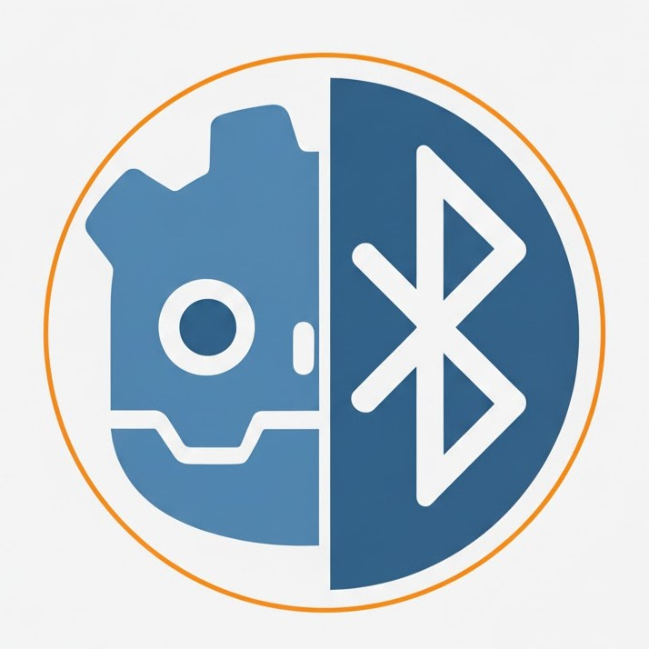

<div align="center">
  

  # BlueDot - Bluetooth LE for Godot

  A simple, Pythonic Bluetooth LE (BLE) extension for Godot 4, built with Rust using gdext and btleplug.

  **⚠️ Experimental / In Development** - This project is in early development and the API may change.
</div>

## Features

- Simple, Python-like API for BLE communication
- Scan for nearby BLE devices
- Connect to BLE devices
- Read and write to BLE characteristics
- Discover services and characteristics
- Cross-platform support (Windows, Linux, macOS)

## Building

### Prerequisites

- Rust toolchain (https://rustup.rs/)
- Godot 4.2 or later

### Build Steps

1. Clone this repository:
```bash
git clone <your-repo-url>
cd bluedot
```

2. Build the extension for your platform:

**Windows:**
```bash
build.bat
```

**Linux/macOS:**
```bash
chmod +x build.sh
./build.sh
```

The build script will automatically detect your platform and compile the library to the correct location in `addons/bluedot/bin/`.

## Installation

1. Copy the entire `addons/bluedot/` folder to your Godot project's `addons/` directory
2. Enable the plugin in Godot: **Project → Project Settings → Plugins → BlueDot**

## Usage

### Basic Example

```gdscript
extends Node

var bluedot: BlueDot
var device: BLEDevice

func _ready():
    # Initialize BlueDot
    bluedot = BlueDot.new()
    if not bluedot.initialize():
        print("Failed to initialize BlueDot")
        return

    # Scan for devices (5 seconds)
    var devices = bluedot.scan(5.0)

    # Print found devices
    for d in devices:
        print("%s - %s" % [d.get_name(), d.get_address()])

    # Connect to first device
    if devices.size() > 0:
        device = devices[0]
        if device.connect():
            print("Connected to %s" % device.get_name())
```

### Reading from a Characteristic

```gdscript
# After connecting to a device
var service_uuid = "0000180f-0000-1000-8000-00805f9b34fb"  # Battery Service
var char_uuid = "00002a19-0000-1000-8000-00805f9b34fb"     # Battery Level

var data = device.read(service_uuid, char_uuid)
print("Battery level: %d%%" % data[0])
```

### Writing to a Characteristic

```gdscript
var service_uuid = "your-service-uuid"
var char_uuid = "your-characteristic-uuid"

var data = PackedByteArray([0x01, 0x02, 0x03])
if device.write(service_uuid, char_uuid, data):
    print("Write successful!")
```

### Discovering Services and Characteristics

```gdscript
# Get all services
var services = device.get_services()
for service in services:
    print("Service: %s" % service)

    # Get characteristics for this service
    var characteristics = device.get_characteristics(service)
    for char in characteristics:
        print("  Characteristic: %s" % char)
```

## API Reference

### BlueDot

Main class for managing Bluetooth LE operations.

#### Methods

- `initialize() -> bool`: Initialize the BLE manager. Returns `true` on success.
- `scan(timeout_seconds: float = 5.0) -> Array[BLEDevice]`: Scan for nearby BLE devices.
- `is_initialized() -> bool`: Check if BlueDot is initialized.

### BLEDevice

Represents a Bluetooth LE device.

#### Methods

- `get_name() -> String`: Get the device name.
- `get_address() -> String`: Get the device MAC address.
- `connect() -> bool`: Connect to the device. Returns `true` on success.
- `disconnect() -> bool`: Disconnect from the device.
- `is_connected() -> bool`: Check if connected to the device.
- `read(service_uuid: String, characteristic_uuid: String) -> PackedByteArray`: Read data from a characteristic.
- `write(service_uuid: String, characteristic_uuid: String, data: PackedByteArray) -> bool`: Write data to a characteristic.
- `get_services() -> PackedStringArray`: Get all available service UUIDs.
- `get_characteristics(service_uuid: String) -> PackedStringArray`: Get all characteristics for a service.

## Platform Notes

### Windows
- Requires Windows 10 version 1703 or later with Bluetooth LE support

### Linux
- Requires BlueZ (usually pre-installed)
- May need to run with appropriate permissions

### macOS
- Requires macOS 10.13 or later
- Bluetooth permissions may need to be granted

## License

MIT License (or your preferred license)

## Contributing

Contributions are welcome! Please feel free to submit a Pull Request.
