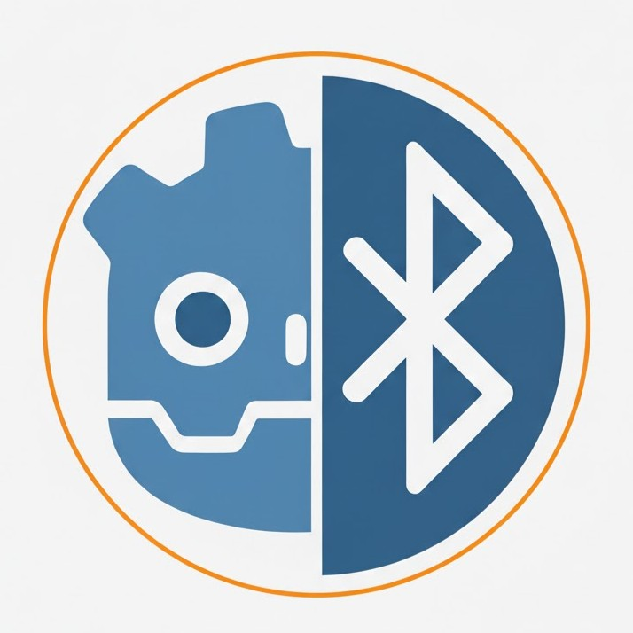

# GdBLE - Godot Bluetooth LE



A simple, Pythonic Bluetooth LE (BLE) extension for Godot 4, built with Rust using gdext and btleplug.

**⚠️ Experimental / In Development** - This project is in early development and the API may change.

## Installation

Copy the entire `addons/gdble/` folder to your Godot project's `addons/` directory, then enable the plugin in Godot:

**Project → Project Settings → Plugins → GdBLE**

## Quick Start

```gdscript
extends Node

var gdble: GdBLE
var device: BLEDevice

func _ready():
    # Initialize GdBLE
    gdble = GdBLE.new()
    if not gdble.initialize():
        print("Failed to initialize GdBLE")
        return

    # Scan for devices (5 seconds)
    var devices = gdble.scan(5.0)

    # Connect to first device
    if devices.size() > 0:
        device = devices[0]
        if device.connect():
            print("Connected to %s" % device.get_name())
```

## API Reference

### GdBLE

Main class for managing Bluetooth LE operations.

- `initialize() -> bool`: Initialize the BLE manager
- `scan(timeout_seconds: float = 5.0) -> Array[BLEDevice]`: Scan for nearby devices
- `is_initialized() -> bool`: Check initialization status

### BLEDevice

Represents a Bluetooth LE device.

- `get_name() -> String`: Get device name
- `get_address() -> String`: Get MAC address
- `connect() -> bool`: Connect to device
- `disconnect() -> bool`: Disconnect from device
- `is_connected() -> bool`: Check connection status
- `read(service_uuid: String, char_uuid: String) -> PackedByteArray`: Read data
- `write(service_uuid: String, char_uuid: String, data: PackedByteArray) -> bool`: Write data
- `get_services() -> PackedStringArray`: List all services
- `get_characteristics(service_uuid: String) -> PackedStringArray`: List characteristics

## Examples

See `example.gd` in the project root for detailed usage examples.
